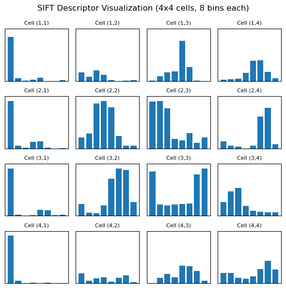

1. Common parameter ranges / notes:
  nfeatures: integer >= 0 (0 = no limit). Increase to restrict number of returned keypoints.
  nOctaveLayers: typically 3. Increasing gives more scale layers per octave (costly).
  contrastThreshold: default 0.04. Typical range ~0.01 - 0.08. Lower -> more keypoints (including low-contrast).
  edgeThreshold: default 10. Larger -> fewer edge responses retained. Values >= 5 are common; increase to suppress edges.
  sigma: default 1.6. Controls initial Gaussian smoothing. Typical ~1.0 - 2.0.

  the keypoints are stored with the cooredinates, the size for the circle and the dominint angle along with some other info about its octave and class id. 

  Analysis
  The output seems to be a bit all over the place with a bunch of keypoints with many seeming not to correspond to a read keypoint or blob. 

  2. The thresholding implemented here went a very long way in reducing the number of erronious keypoints found in the data, I went from 384 keypoint to only 157 with the vast majority of those that are visible being valid keypoints that realisticly correcspond to blobs. this happened becasue I dialed up the thresholds for these datapoints meaning only the highest confidence keypoints could make it through

3. per chatgpt: A SIFT (Scale-Invariant Feature Transform) descriptor encodes local image gradient information around a keypoint in a way that is robust to changes in scale, rotation, and illumination.

The keypoint region is divided into a 4×4 grid of cells (so 16 cells total).

For each cell, a histogram of gradient orientations is computed using 8 bins (covering 0°–360°).

Each histogram entry counts how strong the image gradients are in that direction within that cell.

Thus, you get 4×4×8 = 128 values.

The descriptor is normalized to reduce sensitivity to illumination changes.

👉 So, each 128-D SIFT descriptor is basically a compact summary of how image gradients are oriented around a keypoint.

a descriptor is just a collection of histograms with representations of 8 different directions  this shows the different historgrams in one descriptor

4. The matching that goes on here is very interesting with my best understaing being that the brute force matcher is able to compare every keypoint to every other keypoint and connecting the two that represent the closest match from this data it would be possible to undo the affine transormations done in the first place. 